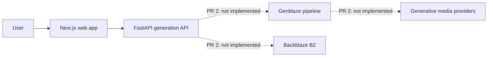

# PRESS system context

Solid arrows exist in PR 1. Dashed arrows are intentional future boundaries and must not be represented as working integrations until independently verified.

The browser never receives B2 or provider credentials. The web app uses a server-only API base URL and maps network, HTTP, and malformed-response failures into stable application states.
